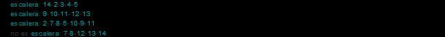
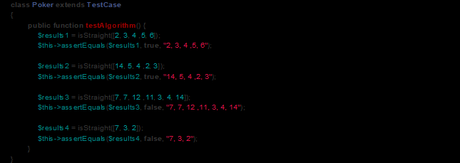
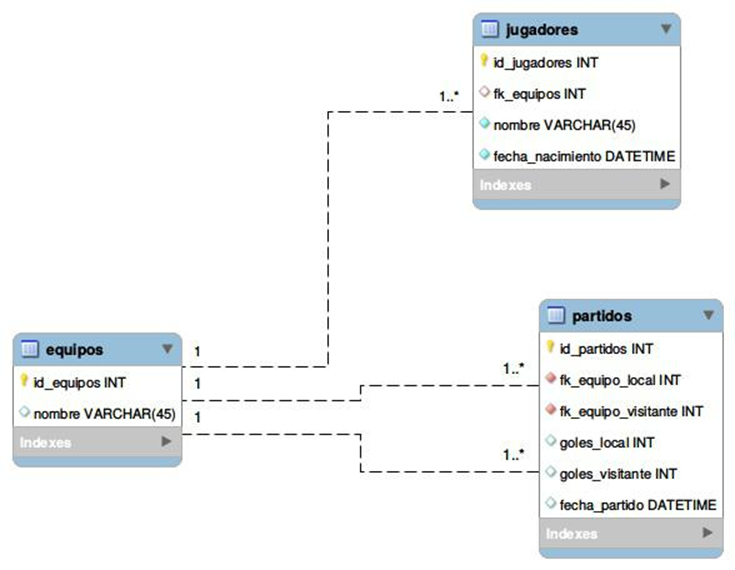

# Preguntas
____________________________________
**1. Supone que en un repositorio GIT hiciste un commit y te olvidaste un archivo.  
Explicar como se soluciona si hiciste push, y como si aùn no hiciste. De ser posible, buscar que quede solo un commit con los cambios.**
## Commit pushed
Cuando he hecho push al repositorio y se me presenta este tipo de escenarios por lo general hag un revert del commit:

- `git log --oneline`  
- `git revert <commit hash>`  
- Hacer los cambios o agregar los archivos
    * `git add <files> `  
- git commit --amend   

## Commit without push

- `git reset --soft HEAD~1` o `git add <agregar files>`
- `git commit --amend`

   
**2. Tienes un sitio en tu computadora de desarrollo, y cuando entras desde el navegador, en la consola te
aparece esto:**  


**El archivo existe, el sitio debe cargar por https. ¿Cómo lo solucionas?**  

- Para este tipo de situaciones tengo dos alternativas una de ellas es crear un certificado auto firmado con una entidad certificadora virtual o usando ngrok.

**3. Tenes un archivo comiteado en un repositorio GIT que deseas que quede ignorado. Que pasos debes realizar?**

- Creo el archivo `.gitignore`.
- Agrego el archivo o la carpeta que deseo ignorar al `.gitignore`.
- Ejecutar `git rm --cached <ruta del archivo o carpeta>` si lo deseas conservar en local de lo contrario eliminamos `--cached`.
- Hacer push al repositorio.

**4. Explica las ventajas de cargar en tu sitio las librerías de terceros por GTM.**  

- Podemos agregar muchas librerías con una sola etiqueta javascript.
- Podemos activar o desactivar librerías desde el panel de GTM evitando cambios en el código.
- Podemos cargar las etiquetas de forma asíncrona.
- Podemos crear etiquetas custom.
- La vista previa es excelente para detectar posibles errores en las etiquetas.
- El historial para ir atrás si algo salió mal en una publicación.
- La posibilidad de agregar activadores y eventos.

# Ejercicio (puede ser php o no)
_____________________________________________________

Escribir una function que determine si un conjunto de cartas de una lista representan una escalera de poker (5 cartas con valores consecutivos) o no.

Las cartas siempre tienen valores entre 2 y 14, donde 14 es el AS.

Tener en cuenta que el AS también cuenta como 1.

La cantidad de cartas puede variar, pero nunca es superior a 7.

Ejemplos:  
  

La function debe validar un caso de pruebas similar a este:  



> Para validar la solución del ejercicio ir a la carpeta **poker** y dentro de ella correr el comando `npm install` y después `npm test`

# MySQL

Dado el siguiente esquema de tablas: 



Escribir las queries para:

- ¿Cuál es el jugador más viejo de cada equipo?  
  ```sql
  select min(fecha_nacimiento) from jugadores GROUP BY fk_equipos
  ```
- ¿Cuántos partidos jugó de visitante cada equipo? (nota: hay equipos no jugaron ningún partido)
  ```sql
  select e.nombre, (SELECT count(*) FROM partidos p WHERE p.fk_equipo_visitante = e.id_equipos) as "Partidos de visitante" FROM equipos e GROUP BY e.id_equipos
  ```
  
# Extra

- Contanos en pocas lineas cual crees que es la mayor innovacion en el mundo del desarrollo en los ultimos 5 años, y por que.  
  * Yo pienso que todo lo relacionado con Inteligencia Artificial. 
  La forma como ahora podemos utilizar la información almacena para crear modelos de autoaprendizaje para la toma, pronóstico e iteración humano máquina se convierte en este momento en una realidad .
    cuando hace par de años atrás era ficción.
